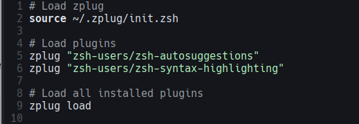
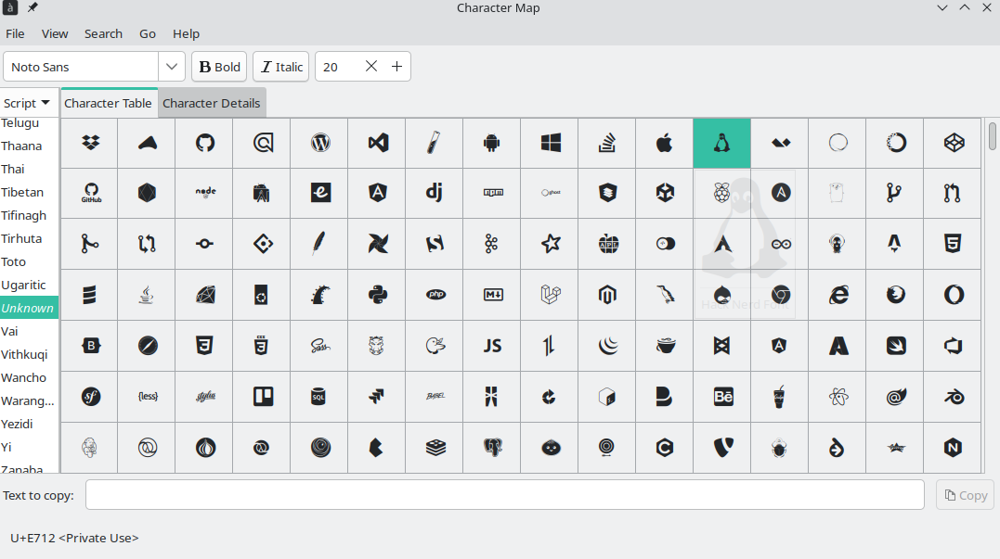

# Make Your Zsh Prompt Look Cool
I use Manjaro Linux with the Plasma desktop environment. In Manjaro, the developers have already customized the prompt like this:


It's already cool, but I wanted to customize it in my own way.

First, I installed the Zsh plugin manager, **zplug**.

#### Install zplug:

`$ curl -sL --proto-redir -all,https https://raw.githubusercontent.com/zplug/installer/master/installer.zsh | zsh`

After that, I deleted the default `.zshrc` file and created a new one, like this:




I decided to use Starship because it provides a customizable prompt.

#### Install Starship:

```$ curl -sS https://starship.rs/install.sh | sh```

After that, I added the init script to my `.zshrc`.

`eval "$(starship init zsh)"`

To use Starship, I needed to install a **Nerd Font**, so I installed **Hack Nerd Font**. You can choose preset prompt designs easily with one command. I chose **Tokyo Night** theme.

`$ starship preset tokyo-night -o ~/.config/starship.toml`

Now, you can check the updated prompt:


It looks cool, but I wanted to replace the logo. So, I searched for one using gucharmap.

`$ sudo pacman -S gucharmap`

I found it:


I replaced the icon by editing `~/.config/starship.toml`. Now, you can check the updated zsh prompt:


